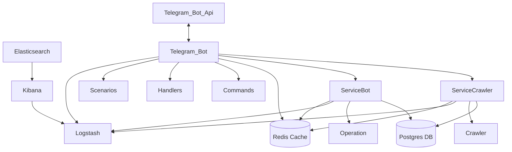

# Magic Crawler

### 1. What is the Project?

This project is a magical crawler bot designed to collect listings from various sites like Divar and Sheypoor. It allows users to search and filter listings based on various criteria, including price range, city, property type, and other features. Through this bot, users can easily search, filter, and access the information they need. The bot is accessible via Telegram, where users can view and receive the listings they are interested in.

---

### 2. How to Run the Project

To run this project, follow these steps:

1. **Install Prerequisites**: Ensure that Go and other project dependencies are installed.
2. **Configure Dev file**: Put real data on the .env.example file and change the file name to .env
3. **Run docker**: Start the docker using the following command:
   ```bash
   Docker compose up - d
   ```
4. **Run the Project**: Start the project using the following command:
   ```bash
   go run main.go
   ```
5. **Access the Bot**: After running the project, you can communicate with the bot on Telegram to conduct your searches.

---

### 3. How to Test the Project

To run tests for this project, use the following command:

   ```bash
   go test -count=1 ./tests/...
   ```
This command will execute all test files located in the tests directory. The -count=1 flag ensures that tests are not cached, and the latest version of each test is run.

---

### 4. Project Structure

The project is organized into various directories, each with a specific responsibility:
   ```bash
   .
├── Dockerfile                   # Docker setup for containerized deployment
├── LICENSE                      # Project license
├── Makefile                     # Automation of tasks like build, test, etc.
├── README.md                    # Documentation file explaining the project
├── cmd                          # Command line applications
│   ├── bot
│   │   └── main.go              # Entry point for the bot
│   ├── crawler
│   │   └── main.go              # Entry point for the crawler
│   └── main.go                  # Main entry point for the project
├── config
│   └── config.go                # Project configuration settings
├── database                     # Database-related code
│   ├── repositories
│   │   ├── bot_repo.go          # Bot database repository functions
│   │   └── crawler_repo.go      # Crawler database repository functions
│   └── setup-db.go              # Database setup and connection
├── docker-compose.yml           # Docker Compose configuration
├── docs
│   └── project_structure.md     # Additional documentation on project structure
├── go.mod                       # Go module dependencies
├── go.sum                       # Checksum of Go module dependencies
├── handlers                     # Handles API requests
│   ├── bot
│   │   ├── apiExtentions.go     # API extensions for bot
│   │   ├── bootstrap.go         # Initialization setup for bot
│   │   ├── handlers.go          # Handlers for bot routes
│   │   ├── middlewares.go       # Middlewares for bot
│   │   ├── routers.go           # Router definitions for bot
│   │   └── views.go             # Views for bot routes
│   └── crawler
│       ├── fetcher
│       │   └── fetcher.md       # Documentation on data fetching
│       └── parser
│           └── parser.md        # Documentation on parsing data
├── logs
│   └── logs.md                  # Log management documentation
├── models                       # Data models for entities
│   └── users
│       ├── user.go              # User model definition
│       └── user_interface.go    # Interface for user model
├── monitoring
│   └── prometheus
│       └── monitoring.md        # Prometheus monitoring setup
├── services                     # Service layer for business logic
│   ├── bot
│   │   └── bot_service.go       # Bot-related services
│   └── crawler
│       └── crawler_service.go   # Crawler-related services
├── tests
│   └── user_handler_test.go     # Unit tests for user handler
└── utils
    └── utils.go                 # Utility functions
   ```

---

### 5. System Architecture

The architecture of the Magic Crawler project is shown in the following diagram. It provides an overview of how the main components interact, including the bot, the crawler, and the database setup.




---

### 6. Future Features

Planned future developments for this project include:

- Listing Comparison
- Price Change Chart
- Support for More Websites
- Premium Accounts

---

### 7. Team Members

- Neda
- Melika
- Sahar
- Sepehr
- Hossein
- Masoud
