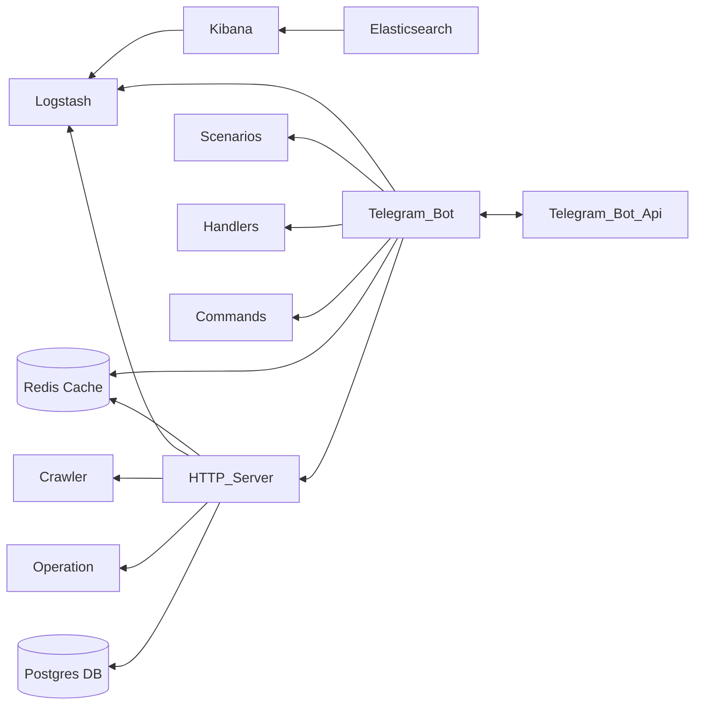

# Crawlzilla Crawler Telegram Bot

## Description

## Setup And Installation

## How To Run

## Testing

## Project Structure

```mermaid
graph RL;
db1[(Postgres DB)]
redis[(Redis Cache)]

HTTP_Server-->db1
HTTP_Server-->Operation
HTTP_Server-->Crawler
HTTP_Server-->Logstash
HTTP_Server-->redis

Elasticsearch-->Kibana
Kibana-->Logstash

Telegram_Bot-->HTTP_Server
Telegram_Bot-->redis
Telegram_Bot-->Commands
Telegram_Bot-->Handlers
Telegram_Bot-->Scenarios
Telegram_Bot-->Logstash

Telegram_Bot_Api<-->Telegram_Bot
```
