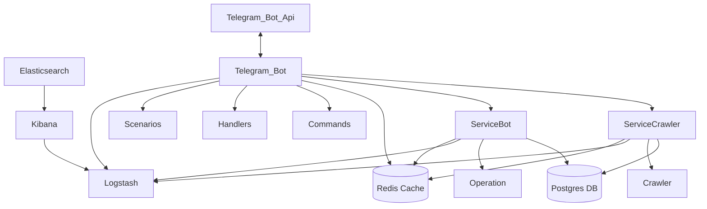

# Magic Crawler

### 1. What is the Project?

This project is a magical crawler bot designed to collect listings from various sites like Divar and Sheypoor. It allows users to search and filter listings based on various criteria, including price range, city, property type, and other features. Through this bot, users can easily search, filter, and access the information they need. The bot is accessible via Telegram, where users can view and receive the listings they are interested in.

---

### 2. How to Run the Project

To run this project, follow these steps:

1. **Install Prerequisites**: Ensure that Go and other project dependencies are installed.
2. **Configure Dev file**: Put real data on the `.env` file. You can use `.env.example`.
3. **Run docker**: Start the docker using the following command:
   ```bash
   Docker compose up - d
   ```
4. **Run the Project**: Start the project using the following command:
   ```bash
   go run ./cmd/server.go
   ```
5. **Access the Bot**: After running the project, you can communicate with the bot on Telegram to conduct your searches.

---

### 3. How to Test the Project

To run tests for this project, use the following command:

   ```bash
   go test -count=1 ./tests/...
   ```
This command will execute all test files located in the tests directory. The -count=1 flag ensures that tests are not cached, and the latest version of each test is run.

---

### 4. Project Structure

This project is organized into multiple directories, each serving a specific purpose. Below is an overview of the key directories in the project:
   ```bash
   .
├───cmd                    # Entry point for the bot and crawler services
│   ├───bot                # Bot service, handles Telegram bot logic and commands
│   └───crawler            # Crawler service, handles web scraping and crawling logic
├───config                 # Configuration files and environment variables
├───database               # Database-related files, including repositories
│   └───repositories       # Contains database queries and repository logic
├───dockerfiles            # Docker-related files for containerization
├───docs                   # Documentation related to the project
├───logger                 # Logger configurations for structured logging
├───logs                   # Application log files
├───models                 # Database models and data structures
├───services               # Business logic and core service implementations
│   ├───ads                # Ad-related service functions (e.g., filtering, pagination)
│   ├───bot                # Contains subdirectories related to the bot service
│   │   ├───commands       # Bot commands and their handlers
│   │   ├───constants      # Constants used throughout the bot service
│   │   ├───conversations  # Conversation management for the bot
│   │   ├───handlers       # Handlers for different bot interactions
│   │   ├───keyboards      # Keyboard layouts for the bot
│   │   └───menus          # Menu structure for bot navigation
│   ├───cache              # Caching mechanisms for improving performance
│   ├───crawler            # Crawling logic specific to Divar and other sites
│   │   └───divar          # Divar-specific crawling implementation
│   ├───filters            # Business logic for applying filters to data
│   ├───search             # Search logic and algorithms
│   ├───super_admin        # Functions and routes for super admin management
│   └───users              # User-related service logic (e.g., user management, authentication)
├───tests                  # Unit and integration tests for various components
│   ├───models_tests       # Tests for model-related logic
│   ├───repositories_tests # Tests for database repositories
│   ├───services_tests     # Tests for service layer logic
│   └───utils_tests        # Tests for utility functions
└───utils                  # Utility functions and helpers used across the project
   ```

---

### 5. System Architecture

The architecture of the Magic Crawler project is shown in the following diagram. It provides an overview of how the main components interact, including the bot, the crawler, and the database setup.




---

### 6. Future Features

Planned future developments for this project include:

- Listing Comparison
- Price Change Chart
- Share Acount
- Premium Accounts
- Config and Start Crawler from Bot
- Monitor CPU and Ram Usage

---

### 7. Team Members

- Neda
- Masoud
- Hossein
- Sepehr
- Sahar
- Melika
